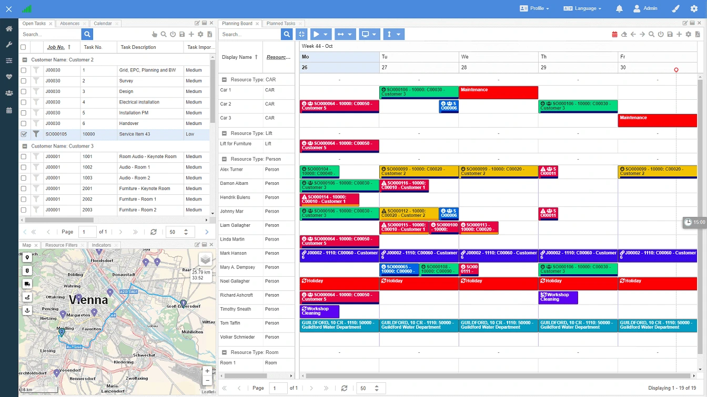

  <a href="https://docs.dimescheduler.com">Documentation</a> |
  <a href="https://docs.dimescheduler.com/history">Changelog</a> |
  <a href="https://docs.dimescheduler.com/roadmap">Roadmap</a>

<h1 align="center">Dime.Scheduler Connect</h1>

Connect with Dime.Scheduler through an Azure Function.

## Build and run

### Locally

Follow the instructions as specified [here](https://docs.microsoft.com/en-us/azure/azure-functions/functions-develop-local).

### Docker

| Description | Command                                                                 |
| ----------- | ----------------------------------------------------------------------- |
| Build       | `docker build -t dimesoftware/dimescheduler-connect:initial .`          |
| Push        | `docker push dimesoftware/dimescheduler-connect:initial`               |
| Download    | `docker pull dimesoftware/dimescheduler-connect`                        |
| Run         | `docker run -it -d -p 8080:80 dimesoftware/dimescheduler-connect:{TAG}` |

## Usage

OpenAPI docs are exposed through `{URL}/api/swagger/ui`.

Each endpoint exposes the following parameters:

| Name        | Description                                                          |
| ----------- | -------------------------------------------------------------------- |
| ds-uri      | The root URI to Dime.Scheduler                                       |
| ds-user     | The e-mail address of the Dime.Scheduler user                        |
| ds-password | The password of the Dime.Scheduler user                              |
| ds-append   | True if the record must be appended, false if it needs to be removed |
| body        | The object to append or delete                                       |

## Contributing

We welcome contributions. Please check out the contribution and code of conduct guidelines first.

To contribute:

1. Fork the project
2. Create a feature branch (`git checkout -b feature/mynewfeature`)
3. Commit your changes (`git commit -m 'Add mynewfeature'`)
4. Push to the branch (`git push origin feature/mynewfeature`)
5. Open a pull request
